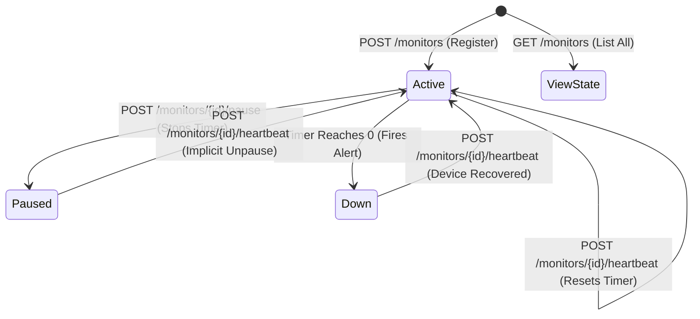

# Pulse-Check-API ("Watchdog" Sentinel)

A Dead Man's Switch API built with Node.js and Express for monitoring critical infrastructure. Remote devices register a countdown timer; if they fail to send a heartbeat before the timer expires, the system triggers a critical alert.

---

## 1. Architecture Diagram

The following diagram illustrates the state transitions of a monitor within the system:



**State Reference**

| State | Description |
|-------|-------------|
| `Active` | Timer is running. Device must send heartbeats before timeout. |
| `Paused` | Timer is suspended. No alerts will fire. Useful during maintenance. |
| `Down` | Timer reached zero. A critical alert has been fired. |

---

## 2. Setup Instructions

1. **Prerequisites:** Ensure you have Node.js installed.
2. **Installation:** Clone this repository and install dependencies:

```bash
npm install
```

3. **Execution:** Start the server:

```bash
npm start
```

4. **Environment:** The API runs on `http://localhost:3000` by default.

---

## 3. API Documentation

### Create a Monitor

- **Endpoint:** `POST /monitors`
- **Payload:**

```json
{
  "id": "device-123",
  "timeout": 60,
  "alert_email": "admin@critmon.com"
}
```

- **Response:** `201 Created`

---

### Send a Heartbeat (Reset / Unpause)

- **Endpoint:** `POST /monitors/:id/heartbeat`
- **Description:** Restarts the countdown timer. If the monitor was in a `paused` state, this call automatically transitions it back to `active`.
- **Response:** `200 OK`

---

### Pause Monitoring (Snooze)

- **Endpoint:** `POST /monitors/:id/pause`
- **Description:** Stops the timer completely for the specified device. No alerts will fire until a heartbeat is received.
- **Response:** `200 OK`

---

### List All Monitors *(Developer's Choice)*

- **Endpoint:** `GET /monitors`
- **Description:** Retrieves a list of all registered devices and their current status (`active`, `paused`, or `down`).
- **Response:** `200 OK`
- **Example Body:**

```json
{
  "count": 1,
  "monitors": [
    {
      "id": "device-123",
      "timeout": 60,
      "alert_email": "admin@critmon.com",
      "status": "active"
    }
  ]
}
```

---

## 4. The Developer's Choice

**Feature: Global Monitor List (`GET /monitors`)**

While the original specification focused on the automation of alerts, it lacked a mechanism for human administrators to inspect the current state of the fleet. I implemented a global list feature to allow maintenance teams to identify which devices are currently paused for repairs or which have already transitioned to a `down` state — without having to manually parse console logs.

---

## 5. Implementation Details (Alerting)

When a timer reaches zero, the system logs a JSON alert to standard output:

```json
{ "ALERT": "Device device-123 is down!", "time": "<timestamp>" }
```